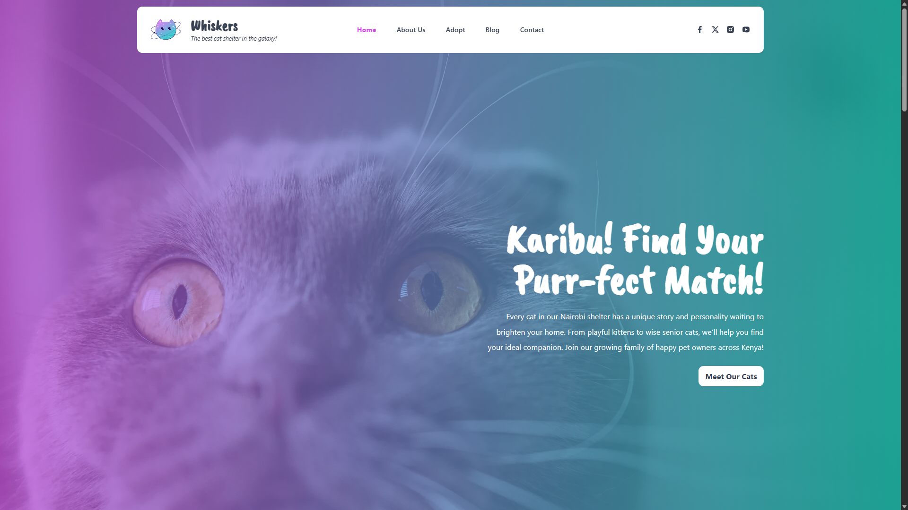

# Whiskers

Welcome to Whiskers, a project dedicated to providing a comprehensive platform for cat shelters in Kenya. Our mission is to connect cats with loving homes and support the vibrant cat community in Nairobi and beyond.


## 🌟 About Whiskers

Whiskers is designed for animal shelter owners, developers, and designers who want to quickly set up a stylish and responsive website. Leveraging modern web technologies, Whiskers ensures a smooth and performant user experience.


## 🛠️ Technologies Used

-   **Astro JS**
-   **TailwindCSS**
-   **Alpine.js**

## 🚀 Installation and Deployment

To get started with Whiskers, follow these steps:

1. **Clone Whiskers**:

    ```sh
    git clone https://github.com/TheODDYSEY/whiskers.git
    ```

2. **Install Dependencies**:

    ```sh
    npm install
    ```

3. **Run Development Server**:

    ```sh
    npm run dev
    ```

4. **Build for Production**:

    ```sh
    npm run build
    ```
## 📝 Blog

Stay updated with our latest posts and news. Discover stories and updates from our community.


## SEO Considerations

Whiskers is optimized for search engines with meta tags, structured data, and fast loading times. Ensure your content is relevant and uses keywords effectively to improve visibility.

## 👀 Need Help?

If you have any questions or need assistance with Whiskers, feel free to reach out to us at info@whiskers.com, or open an issue on the [Whiskers GitHub repository](https://github.com/your-repo/Whiskers).
